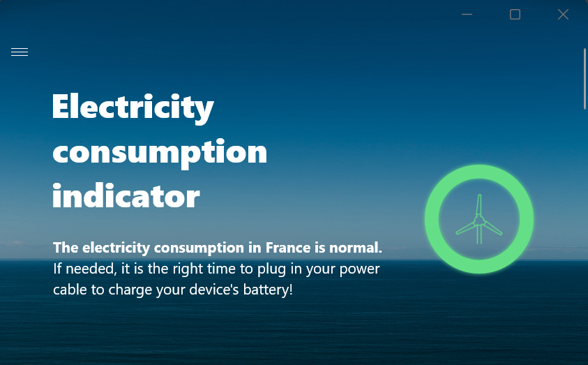
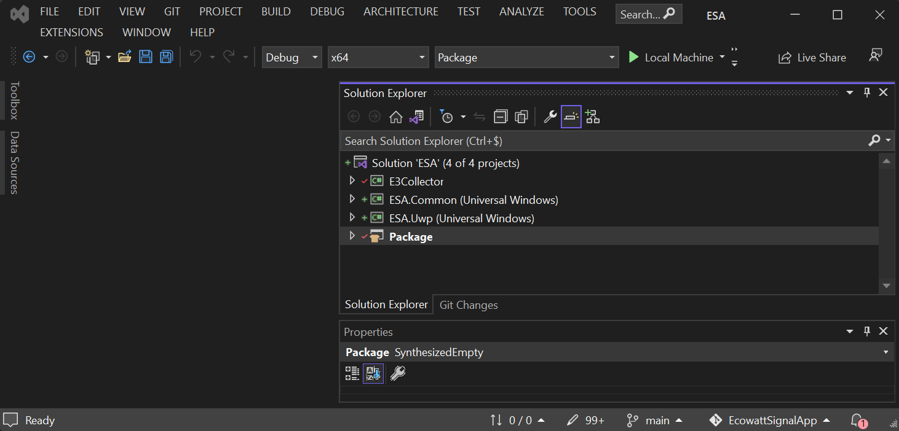

 # About the EcoWatt Signal app
 


*The EcoWatt Signal app enables you to adapt and optimize your energy consumption according to the electricity consumption in France*
 - *Get a real-time simple indicator about the electricity consumption level in France to reduce your consumption to avoid blackouts*.
 - *Follow your device consumption in real time*.
 - *Lnow when eco-gestures have the greatest impact on the electricity system in France*.

By postponing certain uses, you help to ensure that everyone has access to electricity during periods of supply tension. 

Act on your consumption... but at the right time to save electricity during periods of high consumption.
 - When green, the electricity consumption in France is normal. If needed, it’s the right time to fully recharge your device battery ! 
 - When red, the electrical system is very tense with unavoidable blackouts if we do not reduce our consumption. If possible, use you device battery, it’s not the right time to charge it.
 - When orange, the electrical system is tense. Eco-gestures are welcome.

This repos is a WIP (Work In Progress):
 - It provides a simple example for the use of **[EcoWatt API](https://data.rte-france.com/catalog/-/api/consumption/Ecowatt/v4.0)** implementation, through a [UWP (Universal Windows Platform) application](https://learn.microsoft.com/en-us/windows/uwp/get-started/universal-application-platform-guide). 
 - It is a fork of the [WeDeex App repo](https://github.com/Wedeex-DevTeam/WedeexApp) where the EcoWatt API is leveraged in lieu of the Wedeex API, which can provide energy mix production for the French territory.  

## Installation

Simply compile the [Visual Studio Community 2022](https://visualstudio.microsoft.com/vs/community/) solution, according to your architecture, and run the main project "Package"


## Settings

Access to an "electricity weather real-time indicator", i.e., clear signals data , is provided by subscribing to the [EcoWatt API](https://data.rte-france.com/catalog/-/api/consumption/Ecowatt/v4.0). This API is part of the API catalog provided by RTE (Le reseau de transport d'electricite) on its [data portal](https://data.rte-france.com/), and opened to everyone. See [Terms of use](https://data.rte-france.com/en/cgu) for the RTE APIs. 

You will then have to configure the [settings file](ESA.Common/Configuration/Configuration.json) accordingly:

```json
{
  "clientId": "",
  "clientSecret": "",
  "rteAuthorizeUrl": "https://digital.iservices.rte-france.com/token/oauth/",
  "ecowattSignalUrl": "https://digital.iservices.rte-france.com/open_api/ecowatt/v4",
  "notificationHubConnectionString": "",
  "notificationHubPath": "",
  "signatureId": "8d5e9b58-7f5d-4064-a664-b91851d06a50",
  "signatureKey": "06z23z/PDpoaWibwqRJUj3siOyzrhBOP5x4bp1AyEXQ=",
  "telemetryInstrumentationKey": ""
}
```

where

```code
"clientId" and "clientSecret" are required to fetch RTE realtime EcoWatt Signal data from the public EcoWatt API. A prior resgitration is nedeed on the RTE portal,
"rteAuthorizeUrl" is the RTE Autorize endpoint Url to get an access token,
"ecowattSignalUrl" is the RET EcoWatt API endpoint Url to retrieve in realtile the coWatt Signal data,
"notificationHubConnectionString" is your Azure Notification hub connection string,
"notificationHubPath" is your Azure Notification hub path,
"signatureId" is required for integrity checks,
"signatureKey" is required for integrity checks,
"telemetryInstrumentationKey" is your Azure ApplicationInsight telemetry key
```

## Limitations

The EcoWatt API allows to qualify the level of  consumption in real time for only the French territory. 

Moreover, the srumutil.exe is missing in the project. 

# Contributing

This project welcomes contributions and suggestions.  Most contributions require you to agree to a Contributor License Agreement (CLA) declaring that 
you have the right to, and actually do, grant us the rights to use your contribution. 
For details, visit https://cla.opensource.microsoft.com.

Pull requests are welcome. For major changes, please open an issue first to discuss what you would like to change.
Please make sure to update tests as appropriate.

When you submit a pull request, a CLA bot will automatically determine whether you need to provide
a CLA and decorate the PR appropriately (e.g., status check, comment). Simply follow the instructions
provided by the bot. You will only need to do this once across all repos using our CLA.

This project has adopted the [Microsoft Open Source Code of Conduct](https://opensource.microsoft.com/codeofconduct/).
For more information see the [Code of Conduct FAQ](https://opensource.microsoft.com/codeofconduct/faq/) or
contact [opencode@microsoft.com](mailto:opencode@microsoft.com) with any additional questions or comments.

# Legal Notices

Microsoft and any contributors grant you a license to any code in the repository under the [MIT License](https://opensource.org/licenses/MIT), see the
[LICENSE-CODE](LICENSE-CODE) file.

Microsoft, Windows, Microsoft Azure and/or other Microsoft products and services referenced in the documentation
may be either trademarks or registered trademarks of Microsoft in the United States and/or other countries.
The licenses for this project do not grant you rights to use any Microsoft names, logos, or trademarks.
Microsoft's general trademark guidelines can be found at http://go.microsoft.com/fwlink/?LinkID=254653.

Privacy information can be found at https://privacy.microsoft.com/en-us/

Microsoft and any contributors reserve all other rights, whether under their respective copyrights, patents,
or trademarks, whether by implication, estoppel or otherwise.
